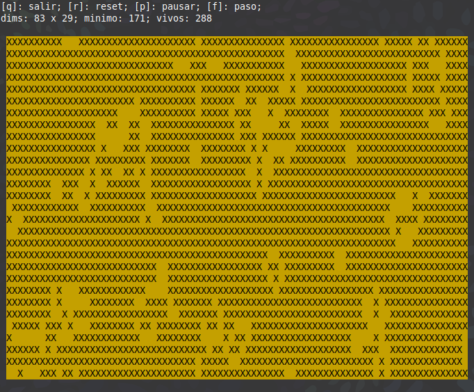

# cgol_cterminal

Juego de la vida de Conway para terminal Linux, hecho en lenguje C

---

## Descripción

Experimento/ejercicio de programación en lenguaje C de interactividad y dibujo en una terminal Linux.

## Ejemplo

Captura de ejecución:

## Información adicional

Copyright © 2020 Julián Díaz Varela, Licencia GPLv3.

Proyecto personal (desatendido).

## Licencia

GPLv3
